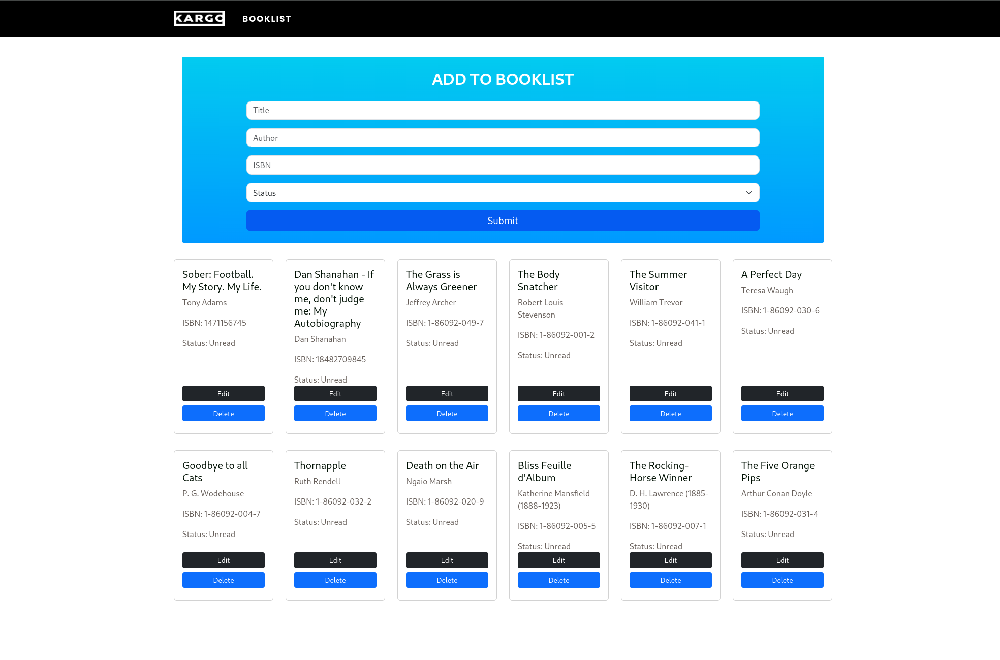

# **Kargo Booklist**

[View Live Project here](http://kargobooklist.eu-west-1.elasticbeanstalk.com/)

<h2 align="center"></h2>

This is a CRUD application where users can Add a book to a list, read the booklist, edit a book, and delete a book.

The website uses React on the frontend and DjangoREST API on the backend. 

[Django Repo here](https://github.com/PatrickCoakley23/book_api)

The React Website and Django website are both hosted on AWS. 

## Containerized Applications

Both applications are containerized using docker

i have added ./docker_build.sh and ./docker_run.sh shell scripts, users have to simply use a cli with Docker installed 

1. `./docker_build.sh` to build the docker image 

2. `.docker_build.sh` to run the container 

3. React app will be available in your browser at `http://127.0.0.1:8080`

## CI/CD Deployment 

This project makes use of Github Actions for effortless deployment and cloud hosting of the React.js applications.

Any pushed changes to the main branch automatically deploy to aws. 

This is configured by the `eb.yaml` file located in the `.github/workflows/` directory
